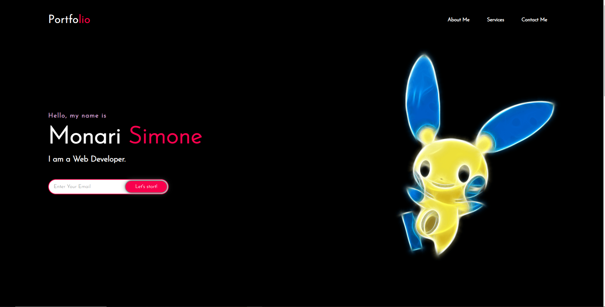

# horiseon-webpage-code-refactor

## Description

This project is a code refactor that is done to make the code more accessible and efficient.

### Actions done
* A descriptive title was added
* CSS was reorganized to follow a logical structure
* Replacing old HTML elements with new semantic HTML elements
* Alt description was added to images

### Link of deployed application
[Link to the deployed website](https://purplelume.github.io/Horiseon-webpage/)